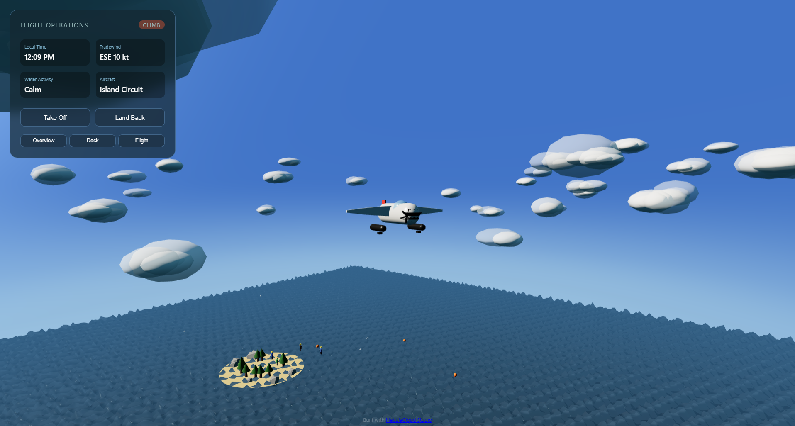

# Seaplane Outpost — Interactive 3D Seaplane Outpost

## PROJECT METADATA

**Project title:**
Seaplane Outpost: Interactive 3D Flight Simulation

**Project subtitle:**
A browser-native simulation of a seaplane outpost with real-time water physics and autonomous flight operations.

**Project category:**
Simulation & Interactive Visualization

**Primary audience:**
Aerospace Engineers, Simulation Specialists, 3D/Web Graphics Developers, Engineering Educators, Product Designers.

**Relevant industries:**
Aerospace, Simulation, Engineering Education, Industrial Design, Software Development.

**Core value proposition:**
It bridges the gap between complex flight and marine dynamics and accessible, browser-native deployment for rapid stakeholder communication.

**Live demo URL:**
[https://studio-public-demos.github.io/seaplane-outpost-showcase/](https://studio-public-demos.github.io/seaplane-outpost-showcase/)

**GitHub URL:**
[https://github.com/studio-public-demos/seaplane-outpost-showcase](https://github.com/studio-public-demos/seaplane-outpost-showcase)

**Studio URL:**
[https://nebulacloud.studio](https://nebulacloud.studio)

---

This project is an immersive 3D simulation of a seaplane outpost, deployed as a demonstration of the capabilities enabled by NebulaCloud Studio.

A custom-built, procedural environment featuring GLSL-based Gerstner water simulation, flight operations physics, and dynamic weather systems, all running in the browser.



[▶ Open Live 3D Demo](https://studio-public-demos.github.io/seaplane-outpost-showcase/)

☁️ Powered by NebulaCloud Studio
NebulaCloud Studio is the ultimate platform for engineering, spatial intelligence, and autonomous systems, enabling teams to bridge the gap between computational physics and accessible, high-performance web-based deployment.

### Ship Engineering Tools, Not Just Results
*   **Interactive Simulations:** Replace static plots and exported screenshots with browser-native, interactive 3D visualizations that let stakeholders explore environments and dynamics in real time.
*   **Parametric Explorers:** Build interactive tools that let users sweep through configurations, environmental parameters, and state sequences — all running live in the browser.
*   **Client-Ready Deliverables:** Turn simulation results into polished, interactive web applications your clients and collaborators can explore on any device — no licenses, no installs, no training required.
*   **Rapid, Reliable Deployment:** Skip weeks of web development and DevOps. NebulaCloud Studio delivers complete, production-ready engineering tools in minutes — from concept to live deployment.

🌟 Join the Future of Engineering Visualization
NebulaCloud Studio handles the heavy lifting of 3D rendering, responsive design, interactive controls, and deployment infrastructure.

👉 Ready to build your own interactive engineering tools? Join our waitlist at [nebulacloud.studio](https://nebulacloud.studio)

✈️ What It Does
| Feature | Description |
| :--- | :--- |
| **Gerstner Water** | Custom GLSL shader with vertex displacement, foam crests, Fresnel, and fog blending. |
| **Floatplane Physics** | Procedural seaplane with buoyancy sampling wave height for realistic bobbing. |
| **Flight Ops** | Autonomous state machine: Idle ↔ Taxi ↔ Takeoff ↔ Cruise ↔ Landing. |
| **Wake & Spray** | Particle-based wake trail and physics-driven spray affected by gravity. |
| **Environment** | Procedural island, dynamic weather, animated workers, and circling seabirds. |

🎯 Target Audiences
| Community | Application |
| :--- | :--- |
| **Simulation Engineers** | Interactive environment modeling, physics demonstration, trade studies. |
| **Software Developers** | Reference implementation of 3D procedural rendering, GLSL water shaders, and autonomous state machines in Three.js. |
| **Engineering Educators** | Interactive classroom demonstrations of physics, fluid modeling, and systems engineering. |
| **Product Designers** | 3D product showcase, interactive configuration exploration. |

🛠 Technical Highlights
| Capability | Technology |
| :--- | :--- |
| **Water Simulation** | Gerstner wave summation, vertex-displacement shader. |
| **Flight Physics** | State machine, buoyancy damping, wake particle trails. |
| **3D Rendering** | Three.js 0.160 with ES import maps — zero bundler, zero build step. |
| **Interactive UI** | Procedural dashboard, real-time telemetry, keyboard controls. |
| **Deployment** | Single-file HTML output — deployable to GitHub Pages, Netlify, Vercel, S3. |

📁 Project Structure
```
.
├── index.html             # Main simulation + all assets
├── README.md              # This file
└── .gitignore
```

🚀 Quick Start
[▶ Open Live Demo](https://studio-public-demos.github.io/seaplane-outpost-showcase/)

```bash
# Clone the repository
git clone https://github.com/studio-public-demos/seaplane-outpost-showcase.git
cd seaplane-outpost-showcase

# Simply open index.html in a modern web browser
```

🔗 Related Demos
*   [VLM Aerodynamics — Interactive 3D wing simulator](https://github.com/studio-public-demos/vlm-aerodynamics-demo)
*   [GeoVision Pro — 3D LiDAR & geospatial product showcase](https://github.com/studio-public-demos/geovision-pro-showcase)
*   [Sponza Palace Viewer — Architectural 3D visualization](https://github.com/studio-public-demos/sponza-viewer)
*   [NebulaCloud Studio](https://nebulacloud.studio/)
